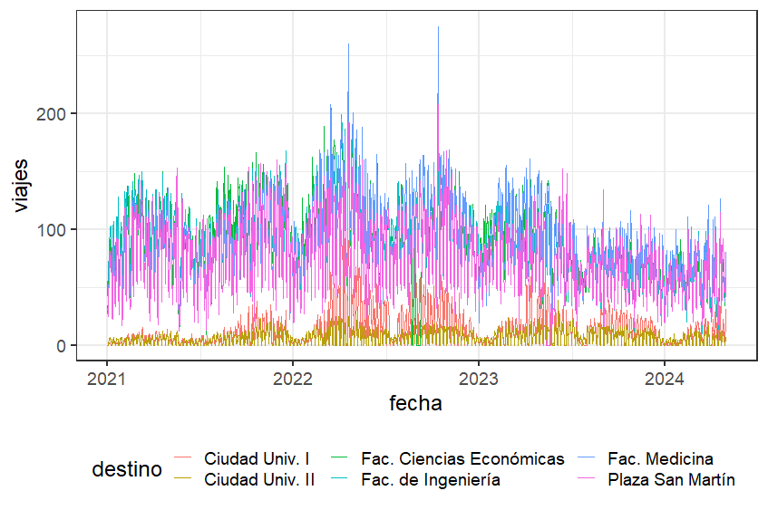
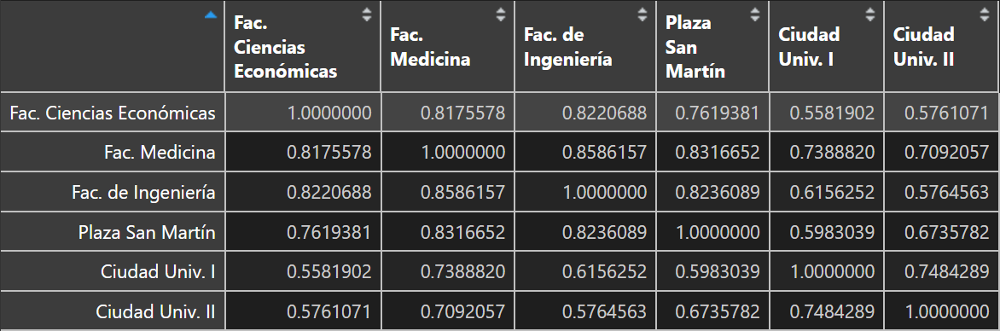

# Análisis de Series Temporales - Trabajo Práctico 1

Se utilizan datos del sistema público de bicicleta de Rosario (fuente: [datos abiertos Rosario](https://datosabiertos.rosario.gob.ar/dataset/0e487f13-7725-4bbf-afea-52e429fa92e5)).

Se recopiló el número de viajes diarios (desde 1/1/2021 hasta 30/4/2024), segmentados según la estación de destino. Se consideraron únicamente los siguientes seis destinos:

* Fac. de Ingeniería
* Fac. Ciencias Económicas
* Fac. Medicina
* Ciudad Univ. I
* Ciudad Univ. II
* Plaza San Martín

